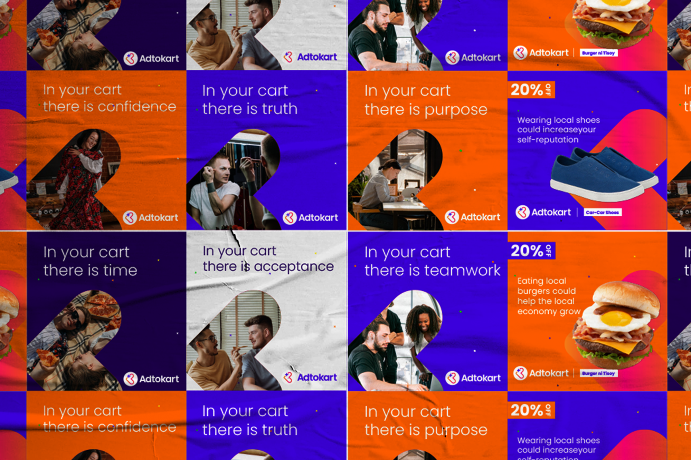

<!--StartFragment-->

An initiative that started out as a local directory to create a space for Cebu’s local sellers and business-owners alike, it was our goal to provide a convenient way to easily access homegrown products and services.

And as their family grows, their services change and progress. With a refreshed identity, we aim to make it easy for customers to browse through an app that is solely made for Cebuano consumers and merchants.

Adtokart — empowering local businesses and building a positive experience for the local community. 

Support and their local business partners by downloading the app at [onelink.to/adtokart](https://onelink.to/adtokart) 

<!--EndFragment-->

