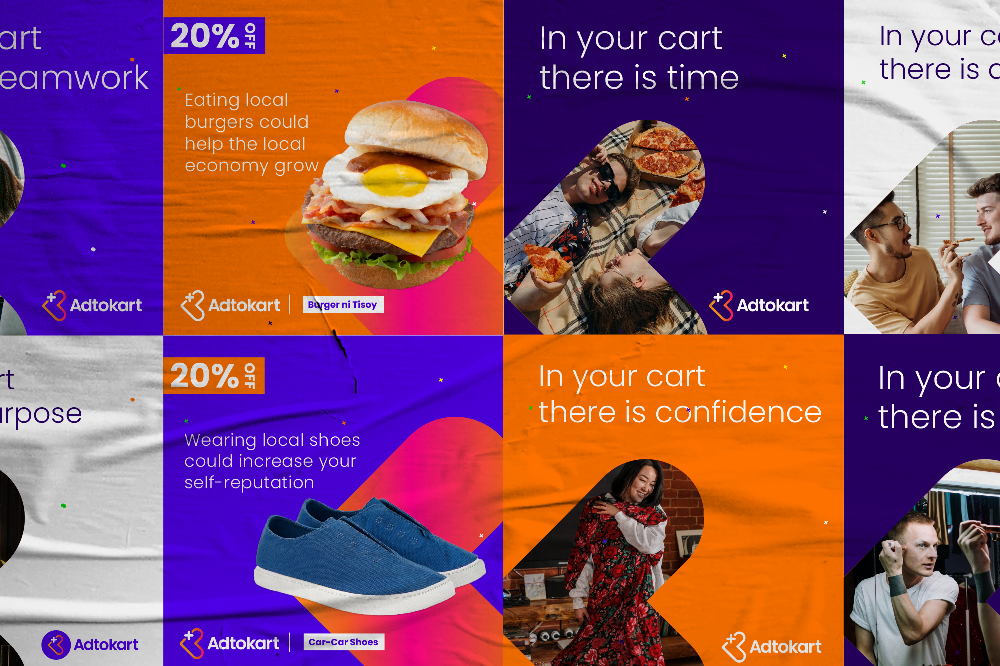

<!--StartFragment-->

<!--StartFragment-->

An initiative that started out as a local directory to create a space for Cebu’s local sellers and business-owners alike, it is Adtokart's goal to provide a convenient way to easily access homegrown products and services. 

And as their family grows, their services change and progress. With a refreshed identity, they aim to make it easy for customers to browse through an app that is solely made for Cebuano consumers and merchants. 

Adtokart — empowering local businesses and building a positive experience for the local community.

<!--EndFragment-->

<!--EndFragment-->

