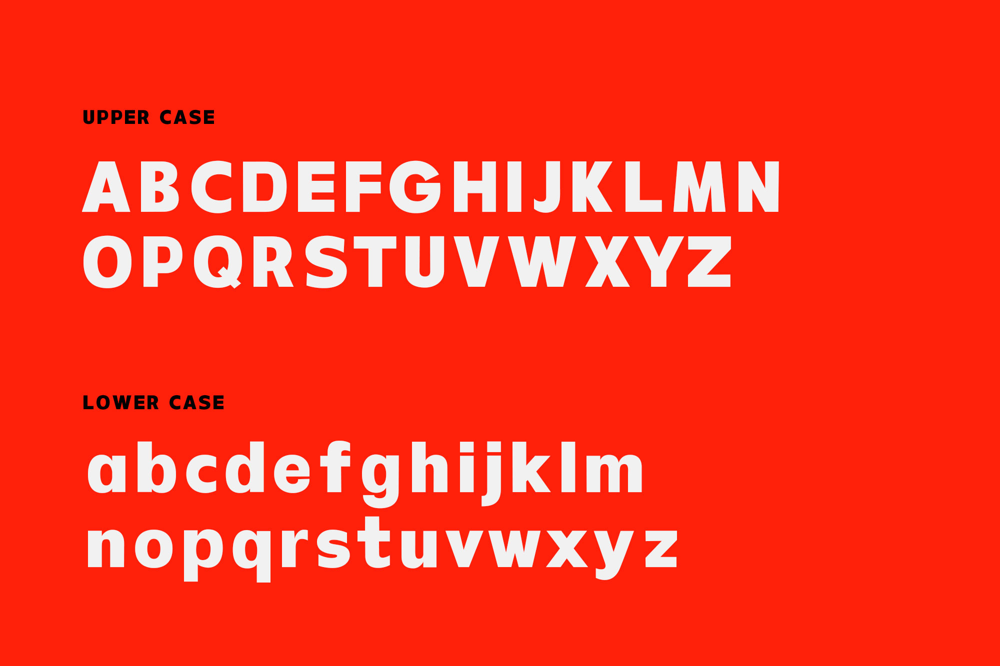

<!--StartFragment-->

 Hooray! The TD Beta font has been approved by Monotype Foundry Platform.

<!--EndFragment-->

<!--StartFragment-->

Monotype was founded 135 years ago as Lanston Monotype Machine Company and is named as "One of the Most Innovative Companies in Design'' by Fast Company. Monotype brings brands to life through type and technology that consumers engage with every day. The company's rich legacy includes a library that can be traced back hundreds of years, featuring famed typefaces like Helvetica, Futura, Times New Roman and more. Monotype also provides a first-of-its-kind service that makes fonts more accessible for creative professionals to discover, license, and use in our increasingly digital world. They work with the biggest global brands, and with individual creatives, offering a wide set of solutions that make it easier for them to do what they do best: design beautiful brand experiences.

<!--EndFragment-->

<!--StartFragment-->

The TD Beta font, proudly crafted by our very own Inu Catapusan and the Tribox Design team, is a bold sans serif typeface inspired by Futura and Helvetica. It is best used for headlines, titles, and display. TD Beta has a total of 186 Glyphs that can support multiple languages.

https://www.myfonts.com/collections/td-beta-font-inusentes-catapusan

<!--EndFragment-->

