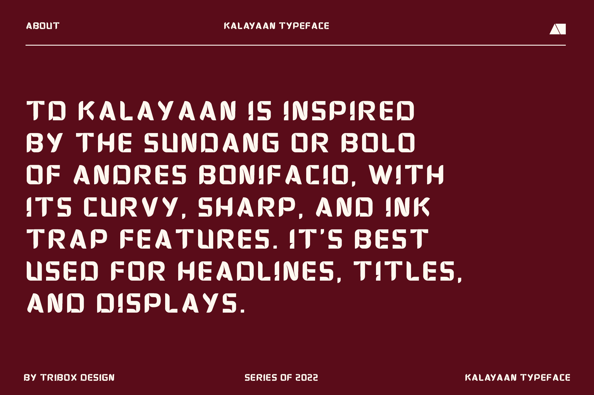
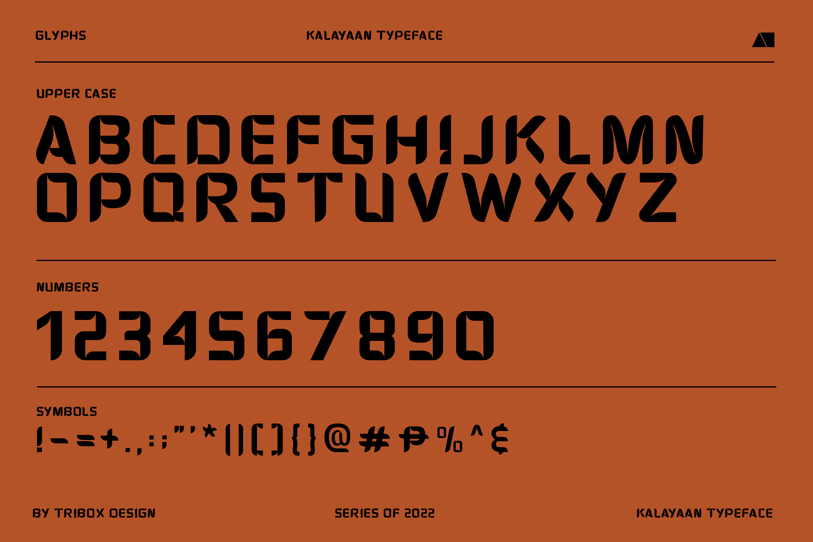
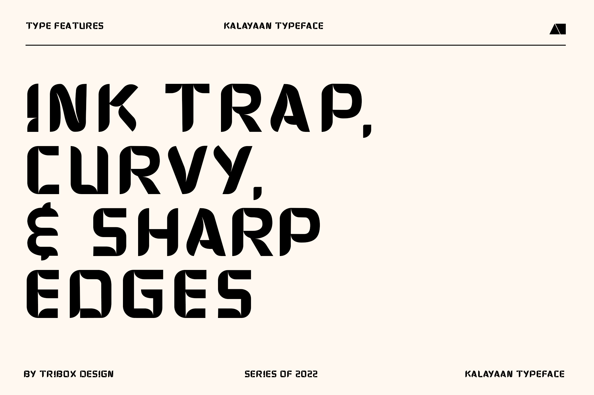
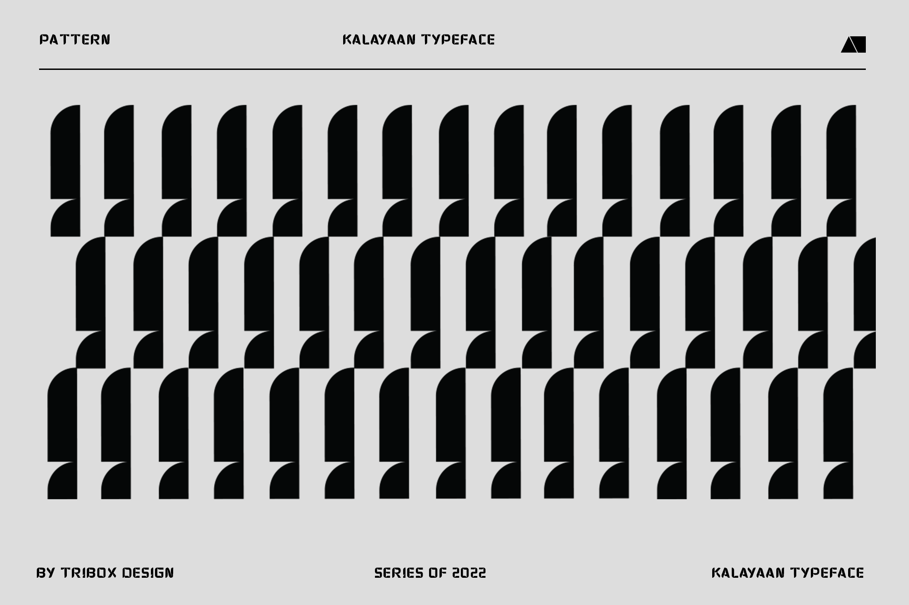
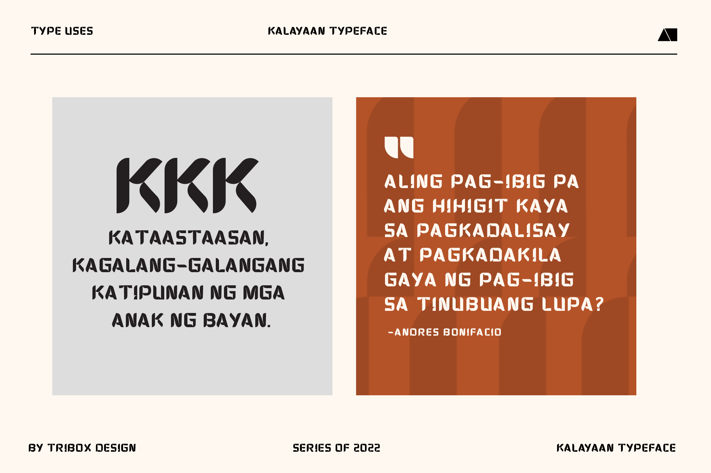
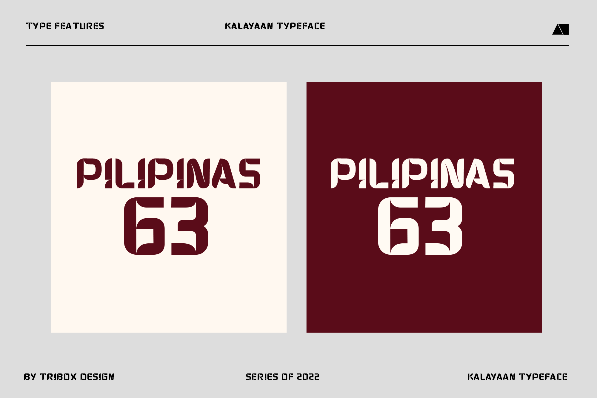

<!--StartFragment-->

TD Kalayaan is inspired by the Sundang or Bolo of Andres Bonifacio, with its curvy, sharp, and ink trap features. It’s best used for Headlines, Titles, and Displays.

Free Download here: [https://inutype.gumroad.com/l/TDkalayaan](https://inutype.gumroad.com/l/TDkalayaan?fbclid=IwAR2eTsFQ2eGN0oqafh2zeElyY2wDdmuwmhLcUWPuKPR4FmzryuOs6oqe_JE)

<!--EndFragment-->

