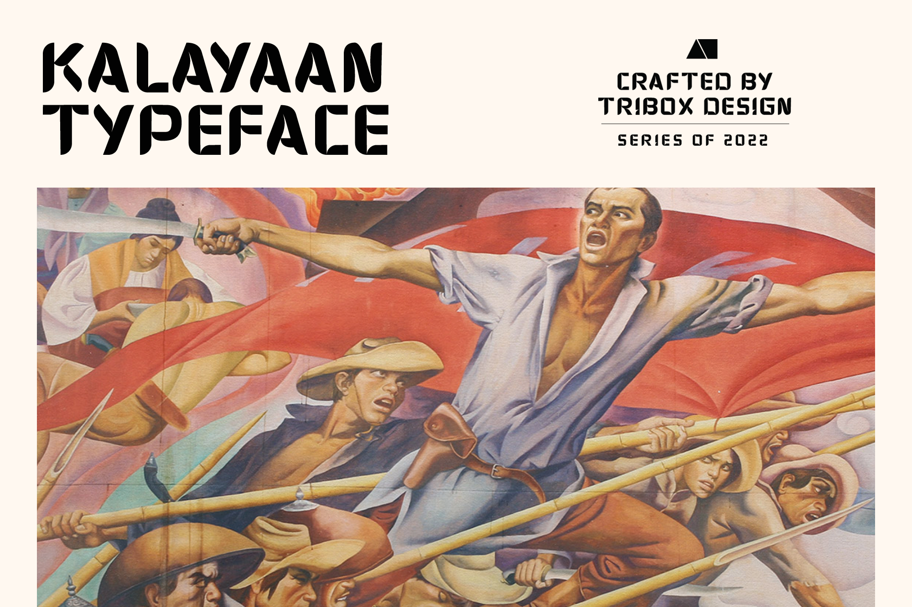
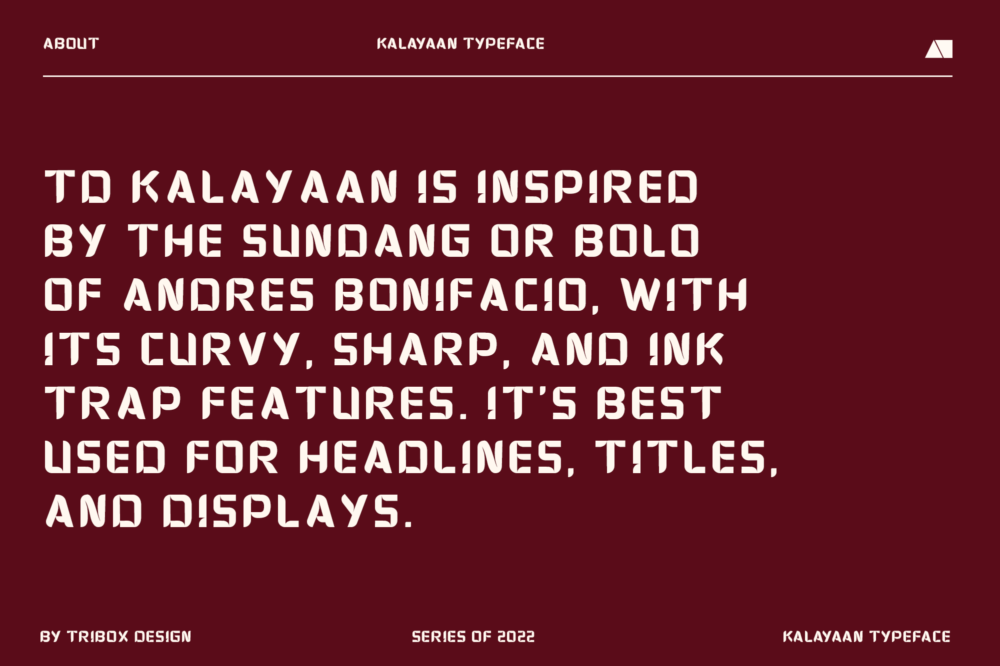
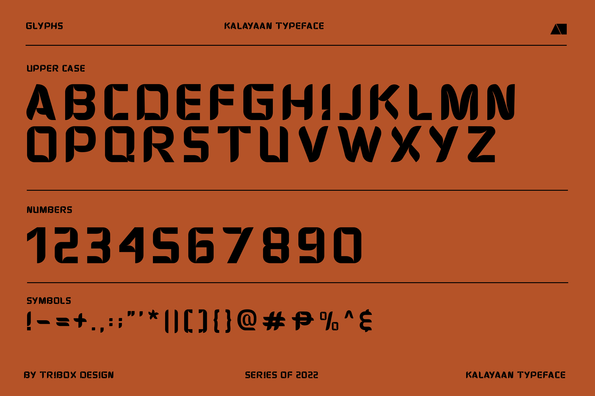
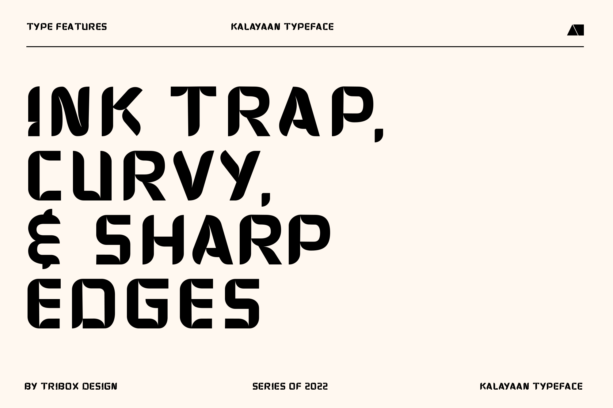
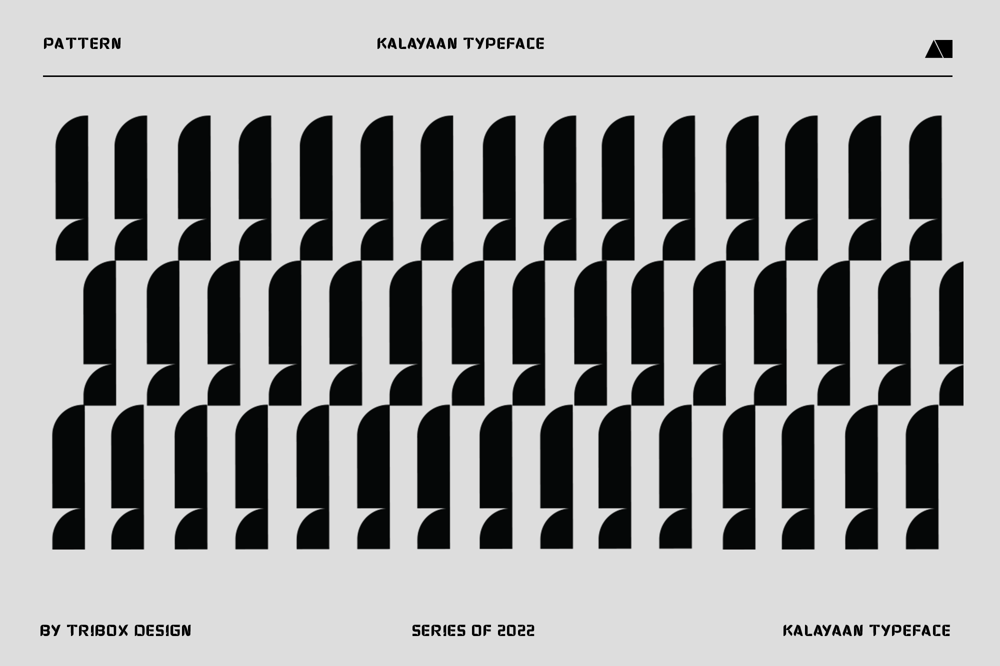
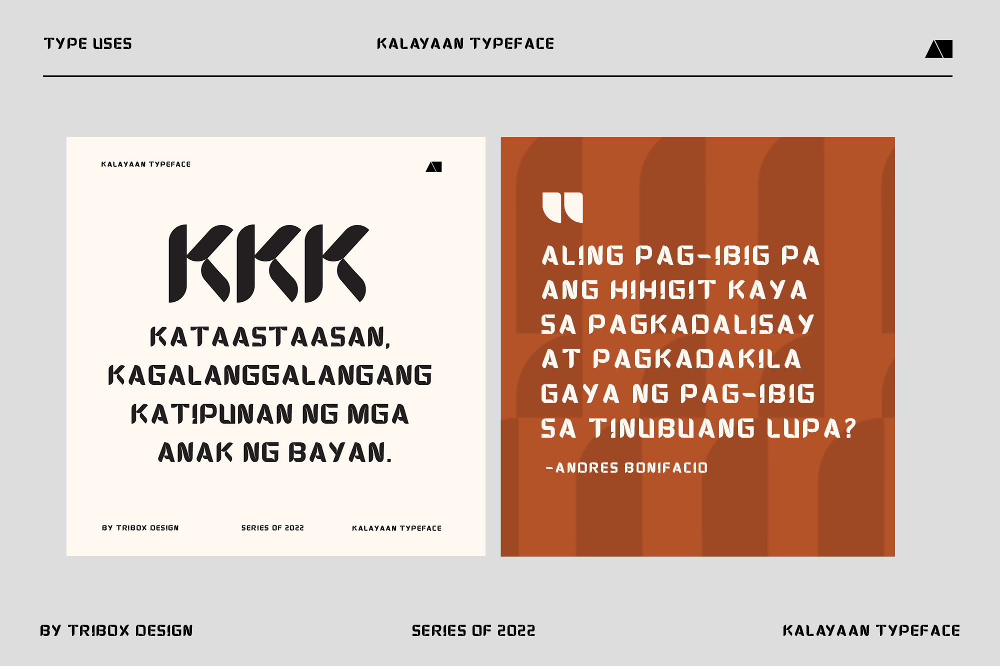
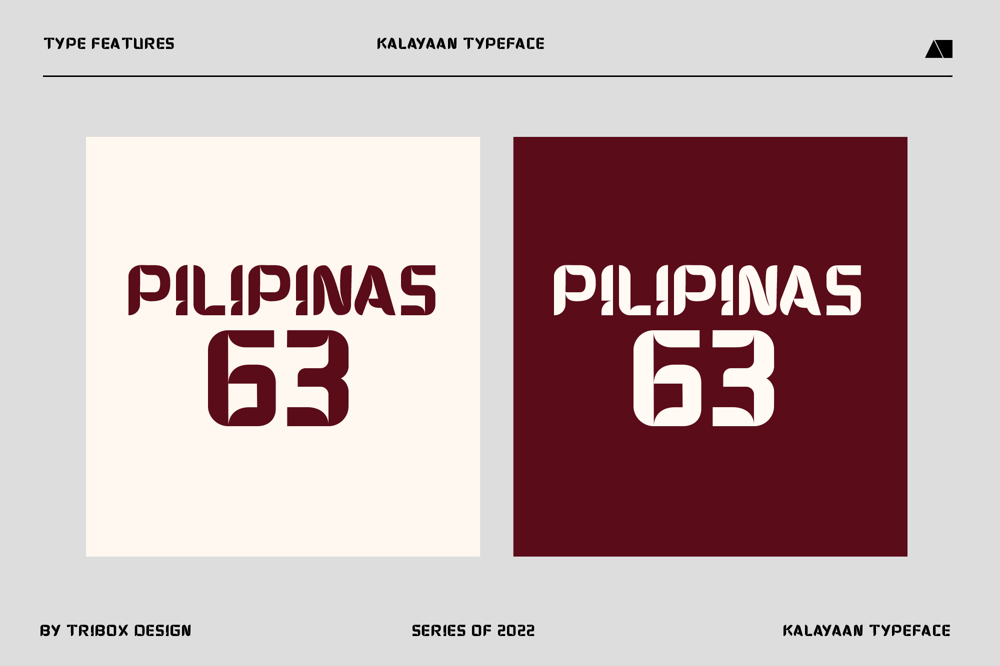

<!--StartFragment-->

[Tribox Design](https://web.facebook.com/triboxdesign/?__cft__[0]=AZWMjWnnQdwX5CrdKbToFfWAyAnzcc90WDsgdFUcfeSt-EUJasgyOVyEnKn68jYiCcU0SqiQEgxXoHg6lTqai3yy4uvDMfyqfx4jgi5c_IrMBJyyi9kgUls4rginz-gRY4H7KLFXGe3f1JoT4y9ylWMydeb1mkrjM02O9CpuwNaHDaQbfy1dBcIfDt89xDV6DpVJydoN9cb-dC7IOnMgbXNh&__tn__=kK-R)'s TD Kalayaan font is now on [Canva](https://web.facebook.com/canva/?__cft__[0]=AZWMjWnnQdwX5CrdKbToFfWAyAnzcc90WDsgdFUcfeSt-EUJasgyOVyEnKn68jYiCcU0SqiQEgxXoHg6lTqai3yy4uvDMfyqfx4jgi5c_IrMBJyyi9kgUls4rginz-gRY4H7KLFXGe3f1JoT4y9ylWMydeb1mkrjM02O9CpuwNaHDaQbfy1dBcIfDt89xDV6DpVJydoN9cb-dC7IOnMgbXNh&__tn__=kK-R)!

TD Kalayaan is inspired by the Sundang or Bolo of Andres Bonifacio, with its curvy, sharp, and ink trap features. It’s best used for Headlines, Titles, and Displays.

Free Download here: [https://inutype.gumroad.com/l/TDkalayaan](https://inutype.gumroad.com/l/TDkalayaan?fbclid=IwAR1QcDRP2_uUZekZsYgXKxUaDrVNSj0qIHwbLGfxqK7XvB0wkn84n-Pal1I)

Empowering the world to design | [www.canva.com](https://www.canva.com/?fbclid=IwAR1E71jcYJs2I2TE1cbfDI5nwVCicwQZ5SELMvsjxkKI5dJzWoqXYTOe8vg)

Defining Brands, Simplifying the complex | [www.triboxdesign.com](http://www.triboxdesign.com/?fbclid=IwAR0BGOC4-X15bQC_-MwZoLMAMmKMyL_arcdPa-uH5MwNJib97MpsPncP3eQ)

<!--EndFragment-->