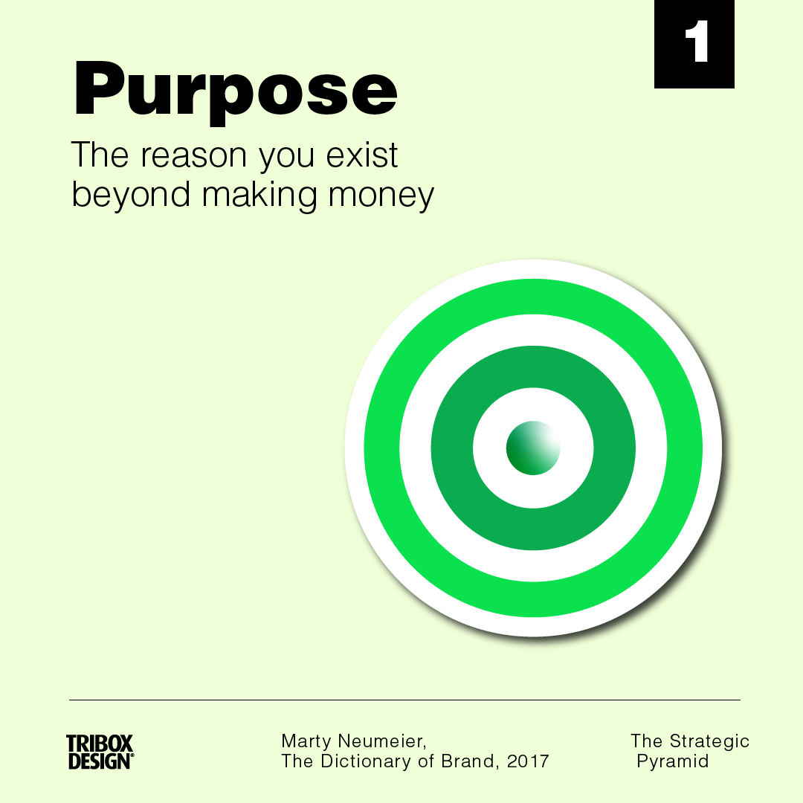
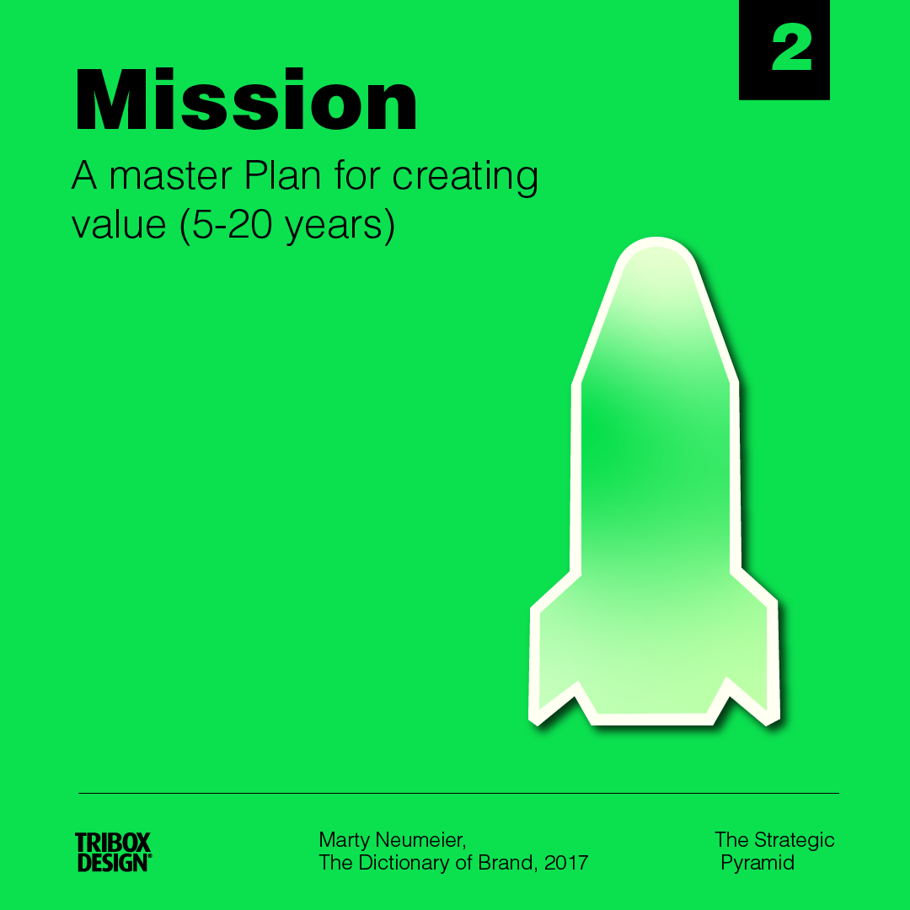
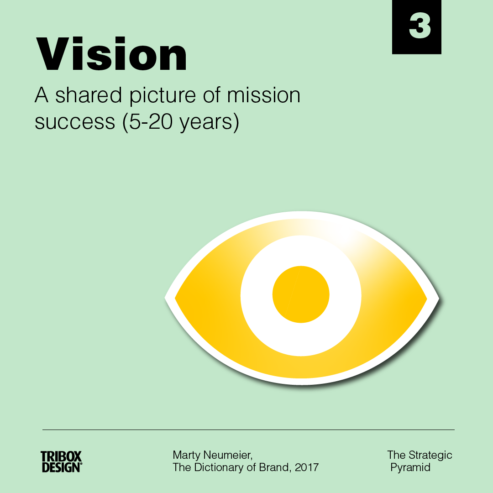
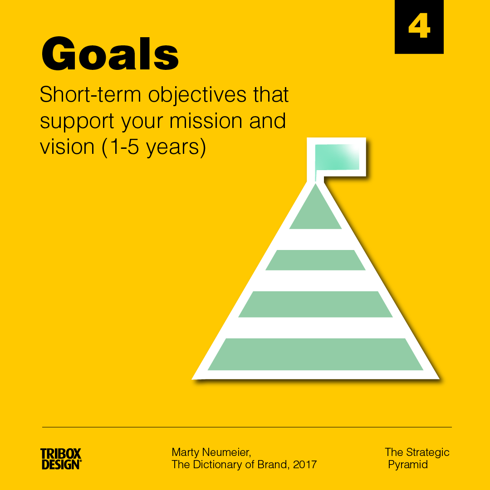

<!--StartFragment-->

What’s the difference between a mission and a vision? How is a purpose different from a goal? Does the corporate mission last forever, or does it change over time?

<!--StartFragment-->

Here’s a simple model from the book Metaskills by Marty Neumeier that puts the major concepts of the last 20 years into a clearly defined hierarchy.

<!--EndFragment-->

<!--EndFragment-->

