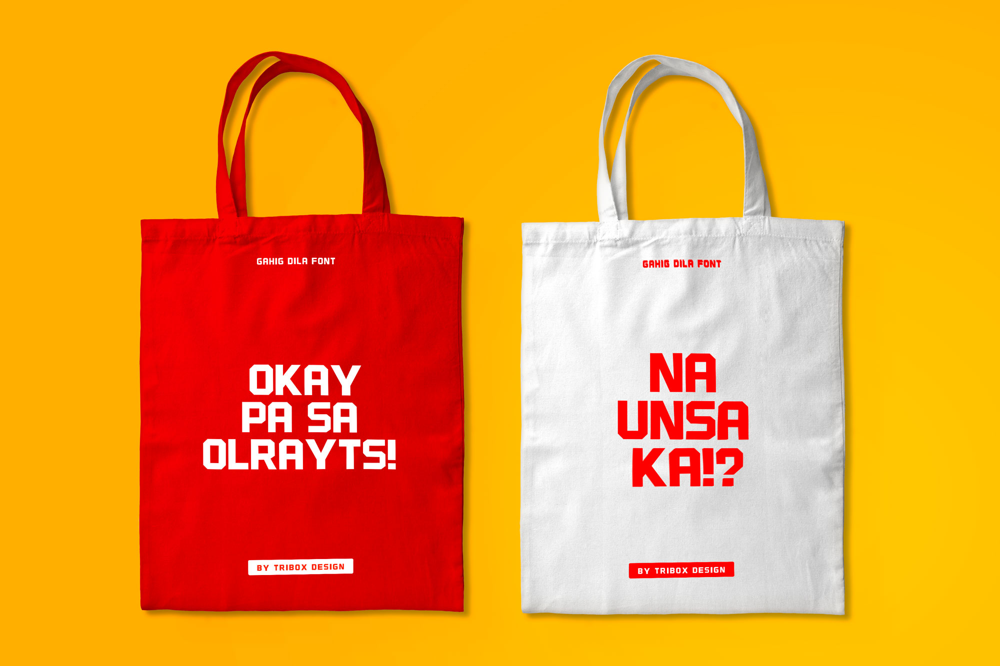
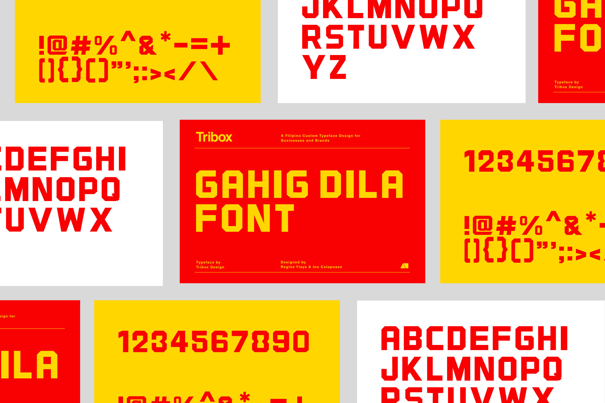
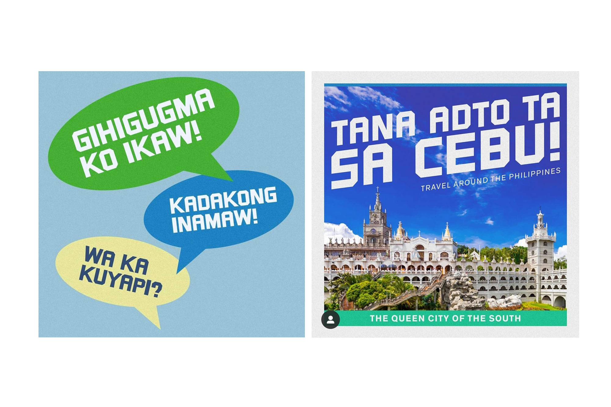
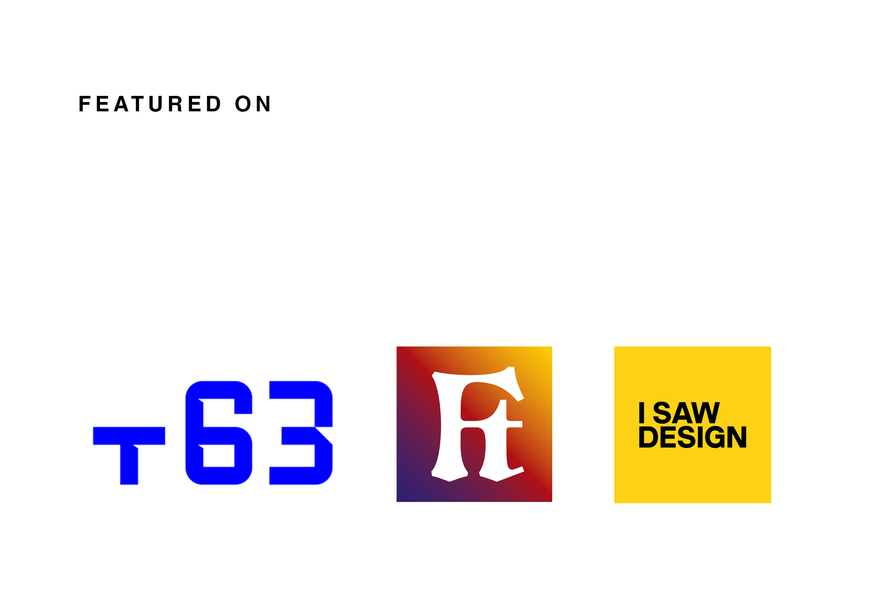

Gahig Dila is a rough cutout-style display typeface by Tribox Design. It's best used for posters, headlines and displays. 

This font is available to download at https://gum.co/gahigdilafont

Featured on Type63 | ISawDesign | Filipino Type: https://bit.ly/3q68GHC