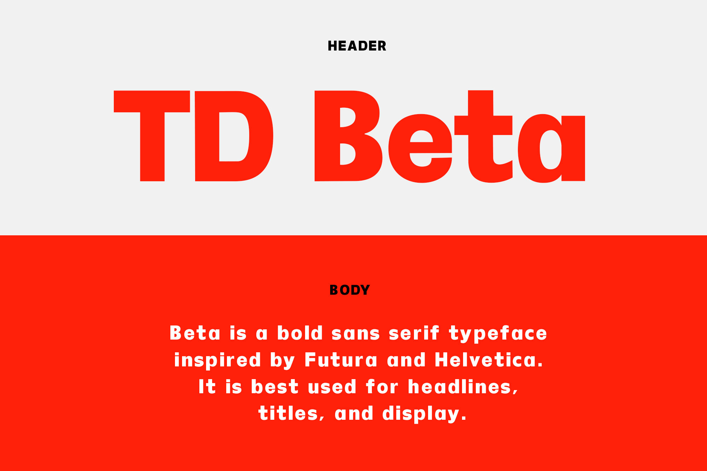

The following character set contains 186 glyphs and is the recommended minimum for Latin-based display fonts. Please note that this limited character set supports a few major Western languages only.

TD Beta is a bold sans serif typeface inspired by Futura and Helvetica. It is best used for headlines, titles, and display.

Download TD Beta on Myfonts by Monotype. | https://www.myfonts.com/collections/td-beta-font-inusentes-catapusan

