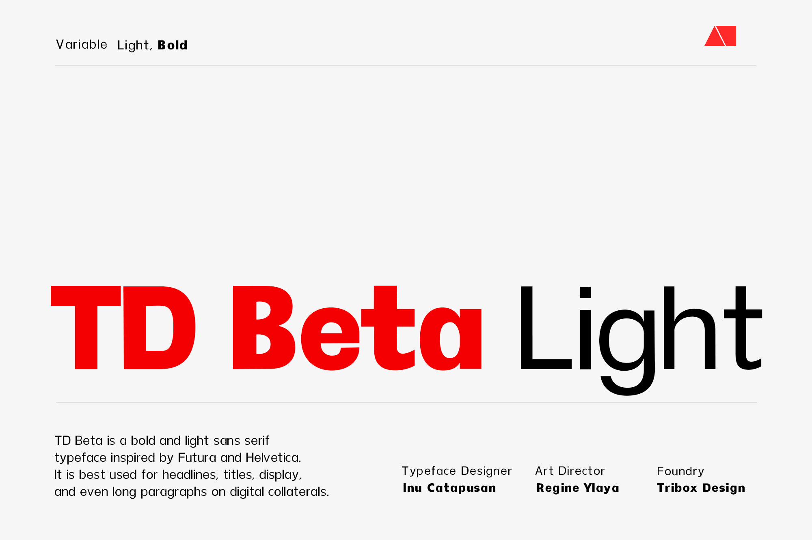
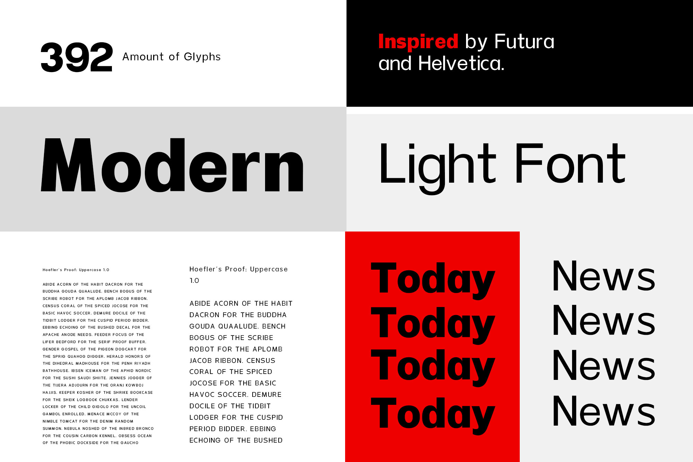
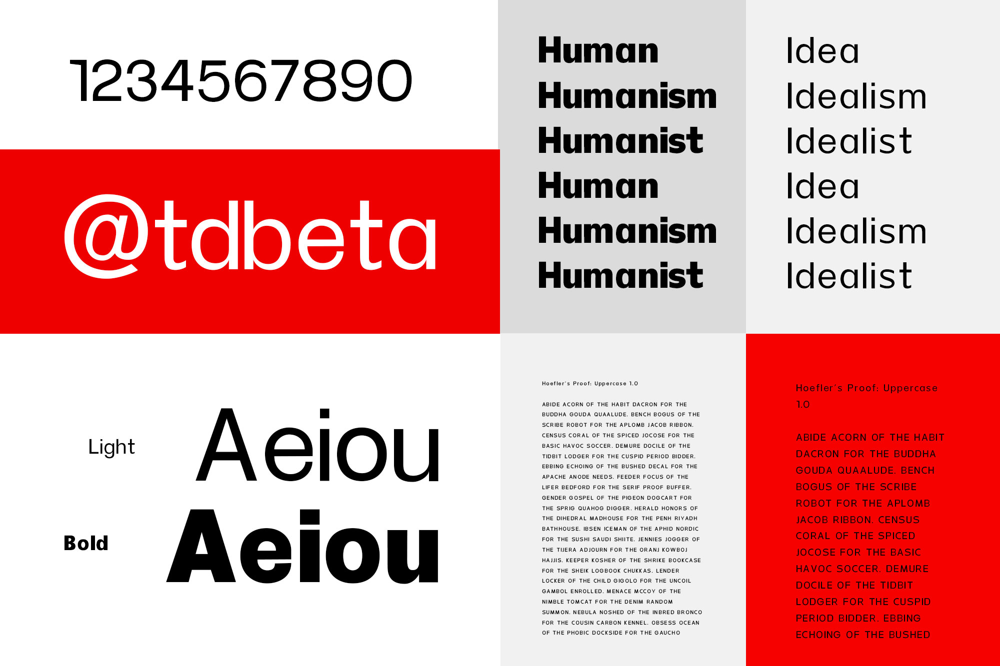
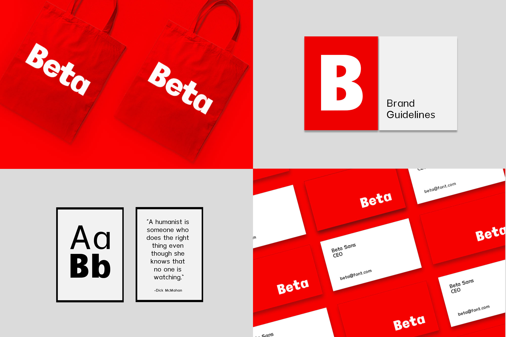

<!--StartFragment-->

TD Beta is a bold and light sans serif typeface inspired by Futura and Helvetica.

It is best used for headlines, titles, display, and even long paragraphs on digital collaterals.

<!--EndFragment-->

<!--StartFragment-->

The TD Beta font, proudly crafted by our very own Inu Catapusan and the Tribox Design team, is a bold sans serif typeface inspired by Futura and Helvetica. TD Beta has a total of 186 Glyphs that can support multiple languages.

<!--EndFragment-->

You can download it here: https://www.myfonts.com/collections/td-beta-font-inusentes-catapusan

