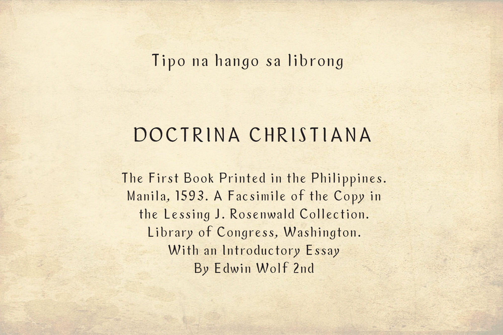

<!--StartFragment-->

**Definition**

Makatà is a Tagalog word that means "poet". Sometimes it refers to fluency in Tagalog/Filipino Language (or magaling mag Tinagalog).

**The** **Briefest History**

The Philippines has a rich literary history beyond the works of its most prominent writer, José Rizal. However, while Rizal primarily wrote in Spanish, many of his contemporaries wrote in the local languages.

The late Francisco Balagtas, considered the King of Poetry in the Philippines, was one of the greatest Tagalog poets and littérateurs during the Spanish rule in the country. One of his most famous works is "Florante at Laura".

Vicente Ranudo was also a Filipino Visayan writer, poet laureate, and Cebu provincial civil servant. He wrote for various pre-war periodicals, including the first Cebuano newspaper, Ang Suga, and was considered the father of Cebuano poetry.

**About TD Makatà Font**

TD Makatà is a typeface based on the font used in the book "Doctrina Christiana", the first book printed in the Philippines.

The "Doctrina Christiana” holds one of the earliest examples of printed Tagalog in Romanized and Baybayin script. Baybayin was a writing system based on an Indic script, which was developed prior to contact with the Spanish. The script is evidence of the Philippines' connection to larger Southeast Asian trends, particularly the use of Indic writing for local languages.

**The Challenge**

Doctrina Christiana is considered one of the most important books, not because it was the first book printed in the Philippines but because of its valuable contribution to the tradition, language, and culture of the Filipinos.

**What is the challenge?**

1. Text used in local books can be difficult to read.
2. Text in many local books are not properly spaced.

**What the team offers:**

1. Re-create each letter.
2. Provide the right kerning for each letter.
3. Reproduce the font and make it available.
4. Explore the new publishing possibilities of Philippine poetry.

**The Team Solutions**

Team Tribox Design created the font to improve the old font print of Doctrina Christiana. Each letter is designed for better readability even in small sizes, particularly for books, and is designed for poets, writers, and anyone who needs a font used in publishing.

**The following are the key features of the typeface:**

1. Flaring terminals on stems and other strokes
2. Open bowl
3. Oval dots
4. Doubled story "a"
5. Single Story "g"
6. Stem curves into a subtle ear
7. Short-tail angled
8. Terminal without balls or teardrops

The font is personally designed and is intended for use by publishers and those seeking publication. We are open to any suggestions, comments, or questions about this font.

It is free for download and will be available on Canva soon!

Download here: [https://inutype.gumroad.com/l/tdmakata](https://inutype.gumroad.com/l/tdmakata?fbclid=IwAR3Hr-A5LCm1eh5tv24k1pTdxJJtdOR0UH5OZzyuPtnyB66LkM6jzXEwqsU)

Daghang Salamat!

Regine Ylaya: Art Director, Research

Inu Catapusan: Font/Typeface Designer, Creative Director, Copywriter

Faye Penetrante: Copy Editor

<!--EndFragment-->

