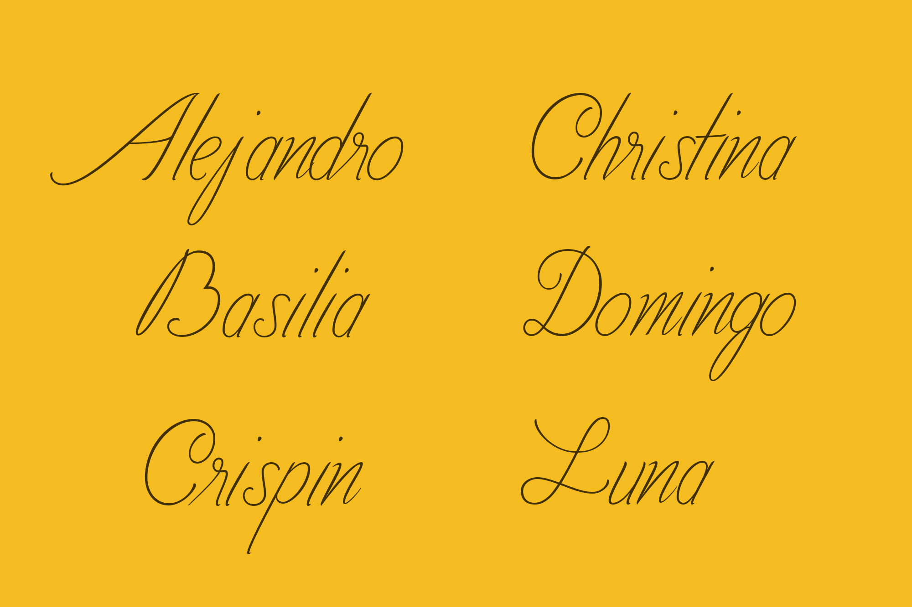

Rooted in the ornate letterforms of the Spanish colonial era, TD Mestiza draws inspiration from the scripts preserved in church archives—birth and death certificates, family records, and genealogical documents that once chronicled entire lifetimes.

The name mestiza itself carries history: in the Philippines, it described women of mixed ancestry, most often of Spanish and Filipino descent, though it also embraced other heritages such as the mestiza de Sangley of Chinese lineage. Over time, the word came to signify not just lineage, but also beauty, refinement, and the cultural fusion that shaped a nation.

This typeface is more than design; it is a journey. Created by two partners retracing their ancestry, TD Mestiza embodies the convergence of cultures, the resilience of memory, and the quiet elegance of archival ink brought into the present.

With its refined yet storied forms, TD Mestiza bridges past and present—an homage to history, a vessel for identity, and a contemporary revival of tradition.

FREE DOWNLOAD FILIPINO FONT: http://bit.ly/4ncduY3\
\
<!--StartFragment-->

Typeface Designer & Creative Director: Inu Catapusan Researcher & Copywriter: Regine Ylaya Mockup Designer: Amabelle Piñon

<!--EndFragment-->

