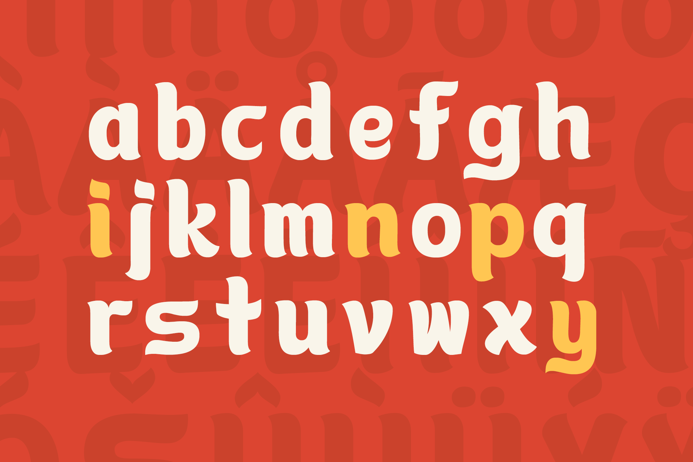
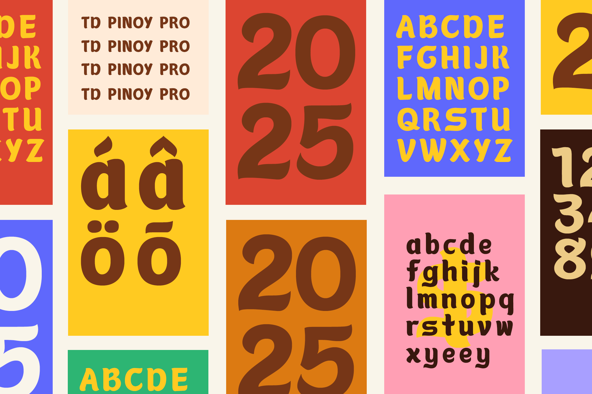
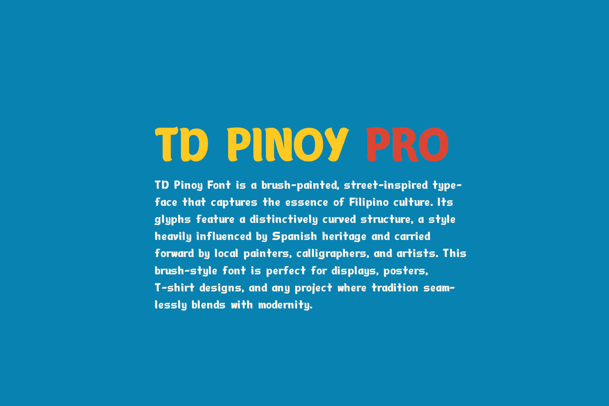

Pinoy font is a combination of free style street sign typography and lettering with a brush-type stroke. The goal of the font is to evoke the resilience and dynamism of Filipinos despite uncertainties and challenges.

Pinoy font is best used for travel blogs, posters, and displays.

TD Sulog now has a Pro Version — an improved style crafted for international use. It includes 375 characters, making it compatible with multiple global languages.

Free Download at https://inutype.gumroad.com/l/pinoyfont

