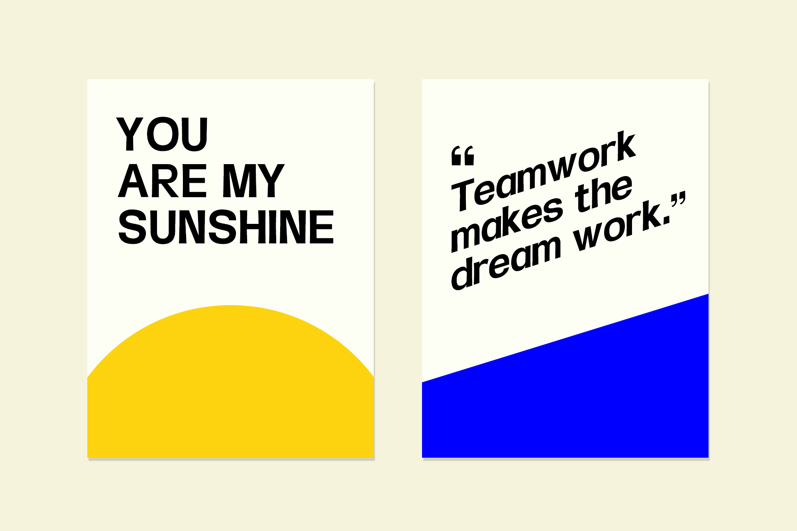
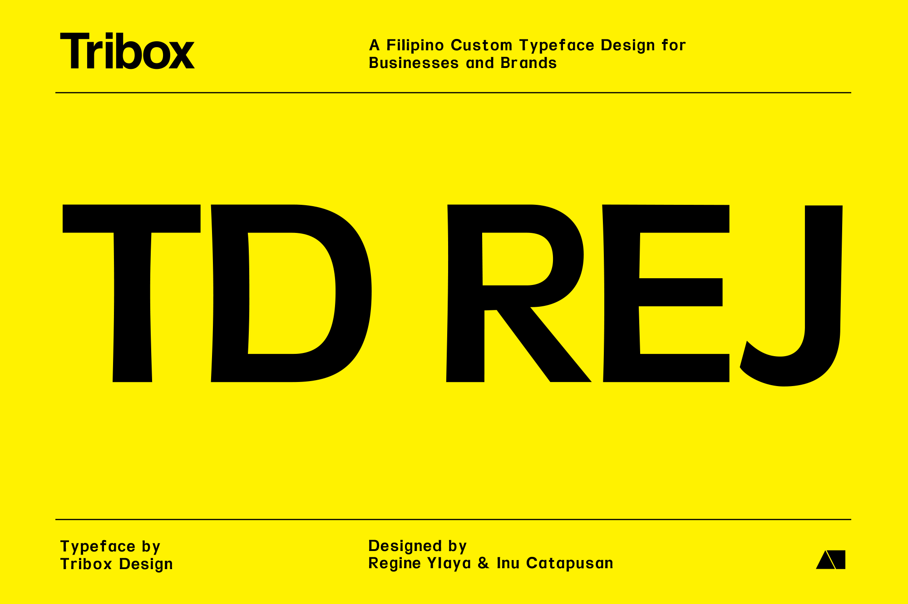

TD REJ is a handwriting-inspired font designed by Tribox Design. Consistently inconsistent, the letters mimic natural handwriting that's equally friendly, classy, and simple, with its very own personality. TD Rej is a suitable writing style, both digitally and in print.

You can download here for FREE: <https://inutype.gumroad.com/l/tdrej>
Featured on Type63: https://bit.ly/3CSbgIX

You can download here for FREE: <https://inutype.gumroad.com/l/tdrej>

Featured on Type63: https://bit.ly/3CSbgIX