<!--StartFragment-->

Tribox Design developed the new brand identity for Multiplier’s Clothier, one of the most trusted and recognized names in modern tailoring based in Cebu, Phillipines. A family-owned business with over 15 years of craftsmanship, Multiplier’s Clothier has built its reputation on quality, precision, and personalized service. 

Commissioned to create a refreshed identity that mirrors the brand’s renewed vision and growth, Tribox Design crafted a logo and visual system that reflect its mission — to multiply opportunities within the community through craftsmanship and service. 

The logo features four distinct needle sizes, symbolizing diversity, inclusivity, and the different “stitches” that connect people from all walks of life. The negative space between the needles forms the letter M, representing both Multiplier’s and the unity of its name, story, and purpose in one timeless mark. 

A brand identity stitched with meaning — honoring tradition, celebrating diversity, and shaping a better fit for the future.

<!--EndFragment-->

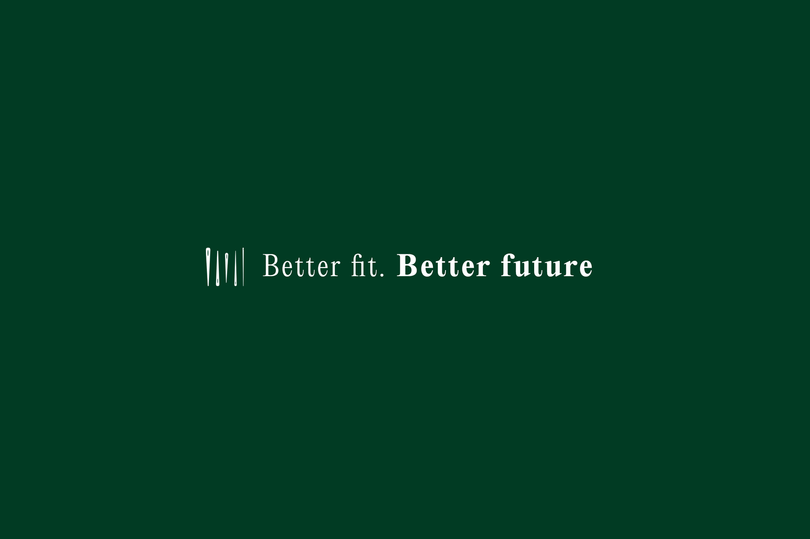

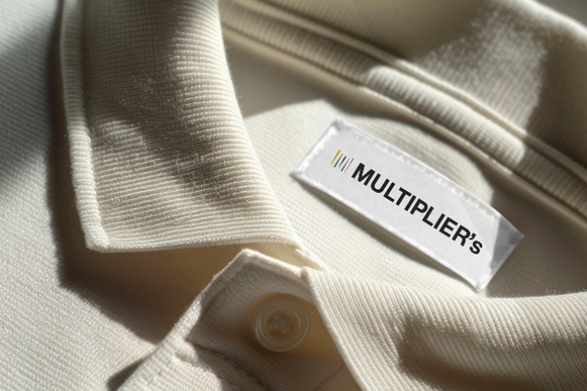

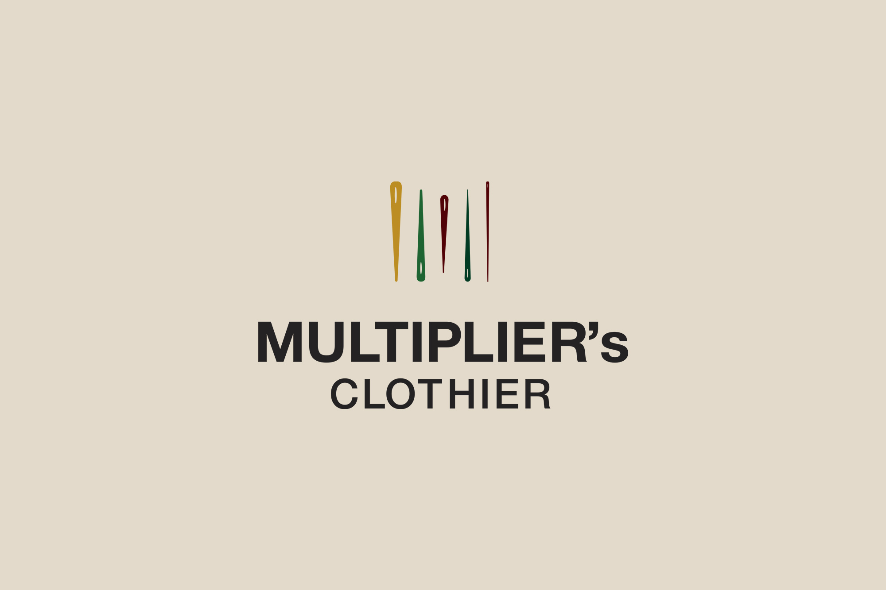

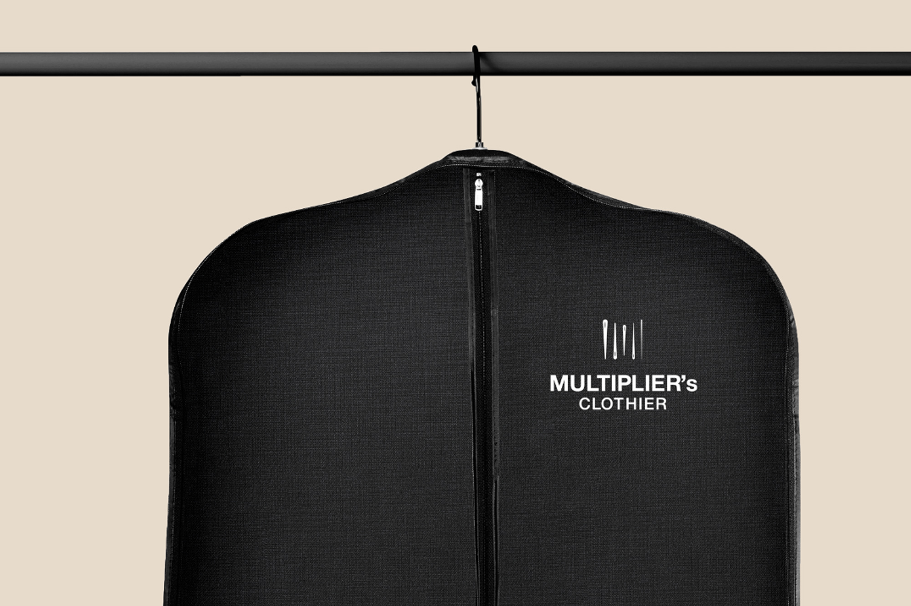

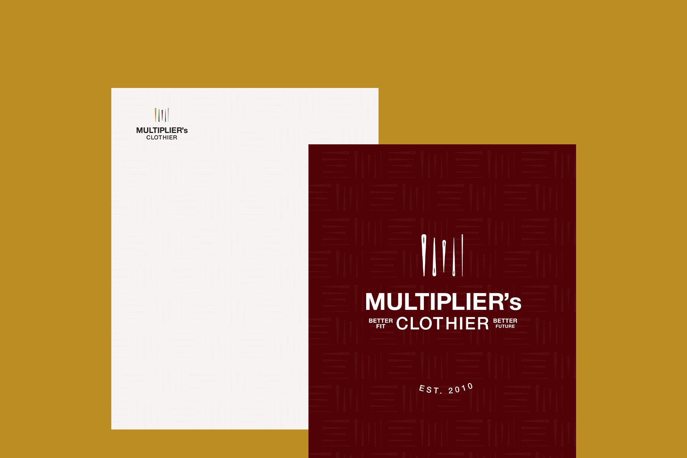

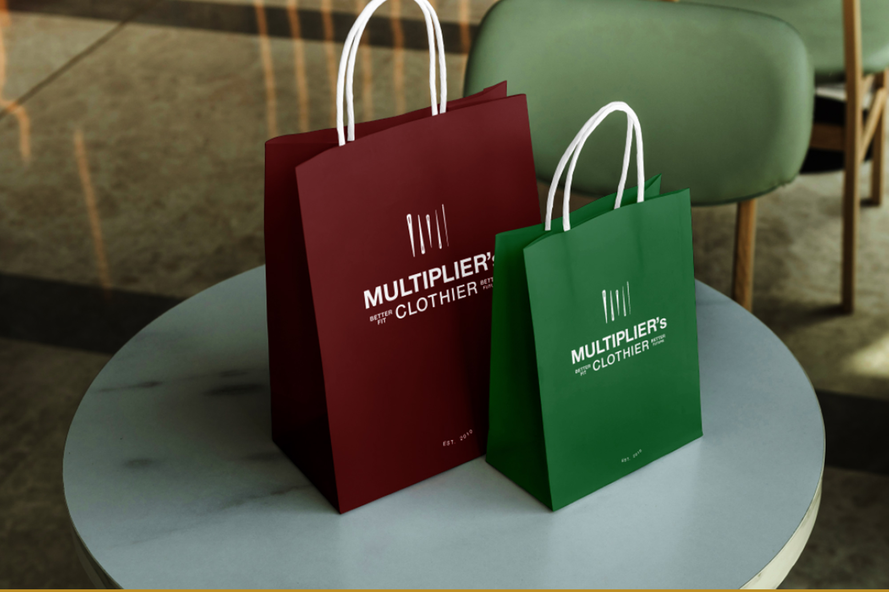

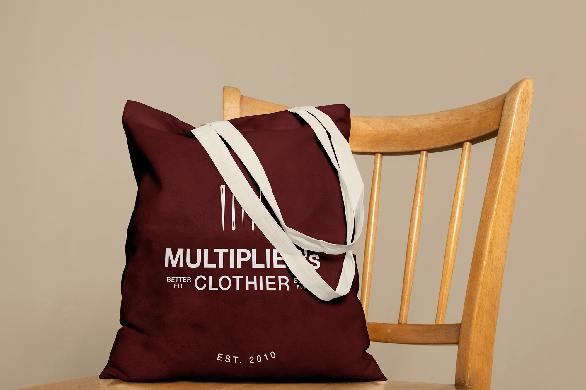

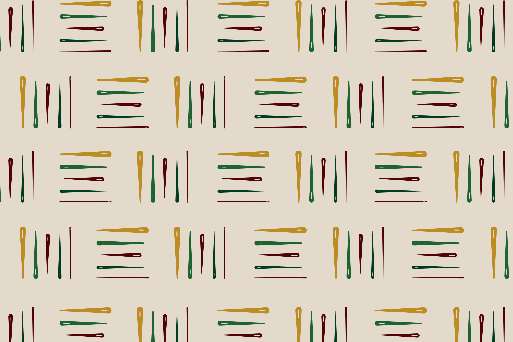

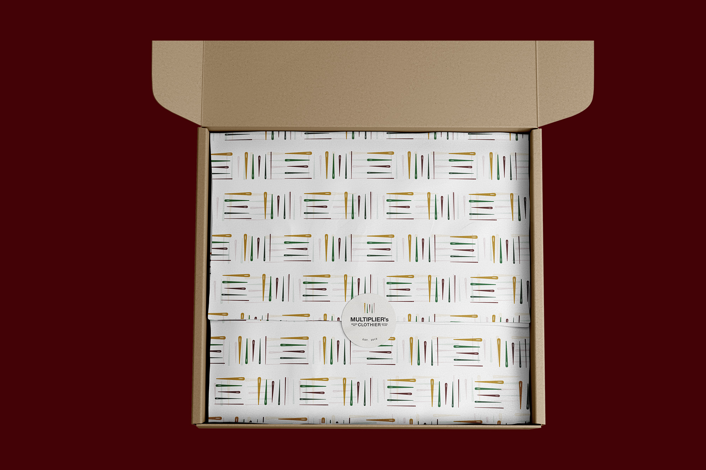

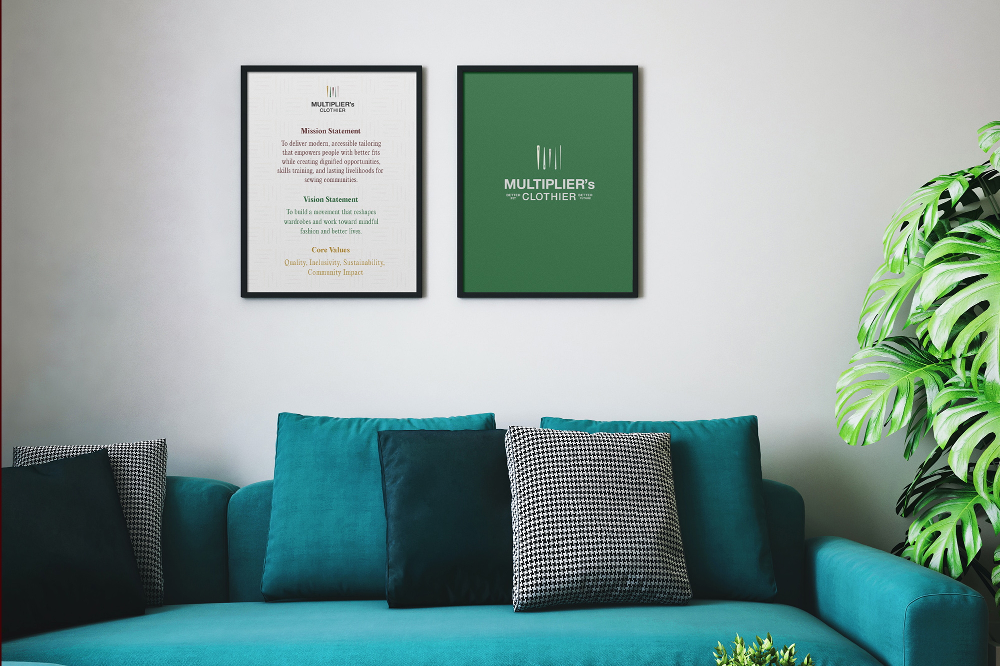

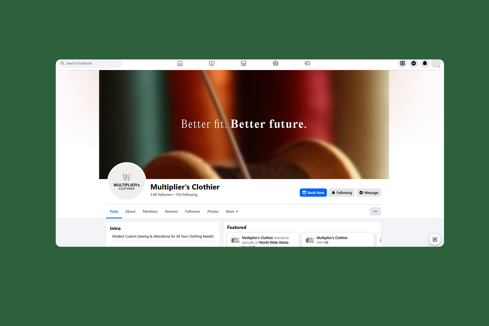

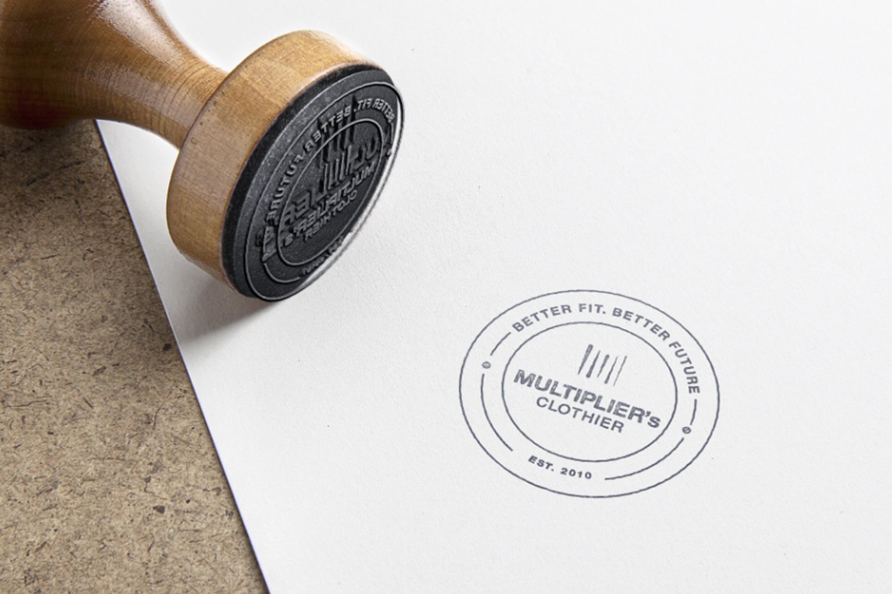