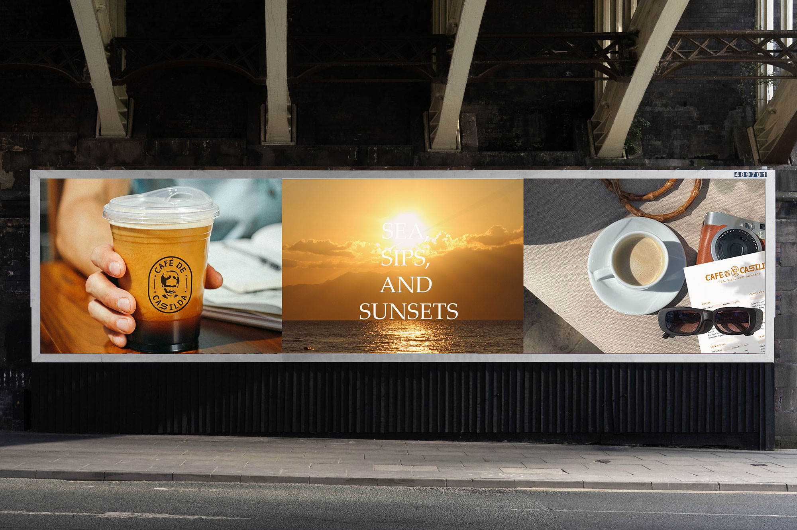
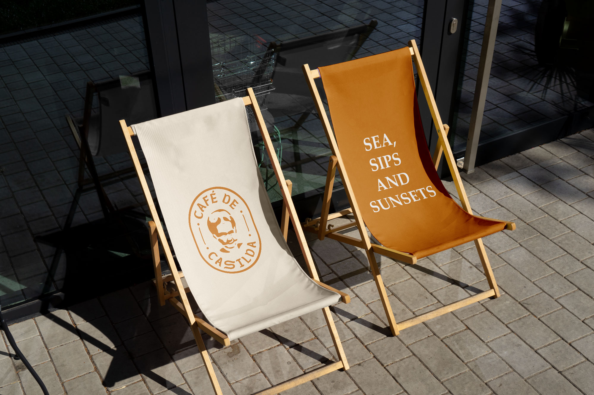
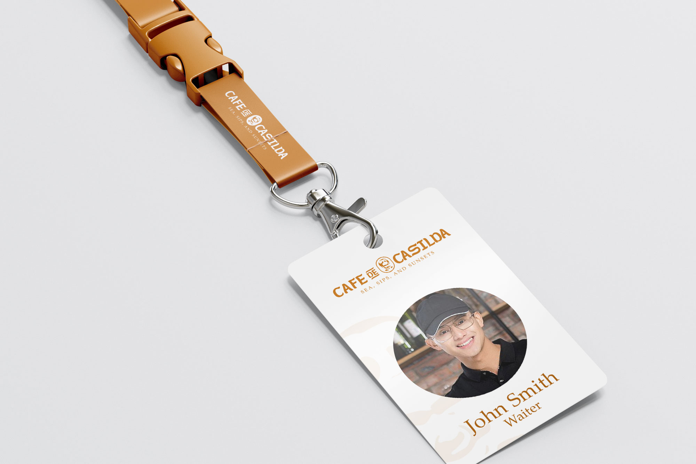

The owner of the café came to us to help shine their vision to be the first café in Moalboal to offer a premium experience through their customer service, drinks, and food. The café is strategically located near the shoreline on owned land and white sand beaches. 

First, to build the brand identity system, research, strategy, and insights must be crafted before we create the identity system. These data that we gathered will help us shape the essence of the brand through the brand identity system. So, research, strategy, and insights are the first things to do when creating the system.

A Brand Identity System is a tangible asset to the brand. It's the face that will encourage people to say, "Please try me." The messaging, color, imagery, and character will be the primary means of communication to reach your target market. 

Now, a brand identity system is not just about that, because people want a more meaningful connection or empathy, from entering the shop, making a purchase, and even when they are at home. They want to feel connected to the brand as often as they can. That's why after-sales customer service is a must to extend the brand identity system of a brand. It's no longer just about tangible assets; connections matter too.

One of our challenges in creating the brand identity system was to incorporate the image portrait of their late grandmother, as we were not accustomed to creating that kind of identity. The owner wanted to honor his mother by including her face as a symbol of the café.

To address these challenges, our approach was to create a brand identity that looks and feels classic. This means the brand will appear as if it has been in operation for 30-50 years. To provide a solution, we first selected a customized font that feels classic, authentic, and luxurious, and incorporated the mascot of their late grandmother. The owner was very pleased with the result from the beginning to the end, along with the tagline "Sea, Sips, and Sunsets."

