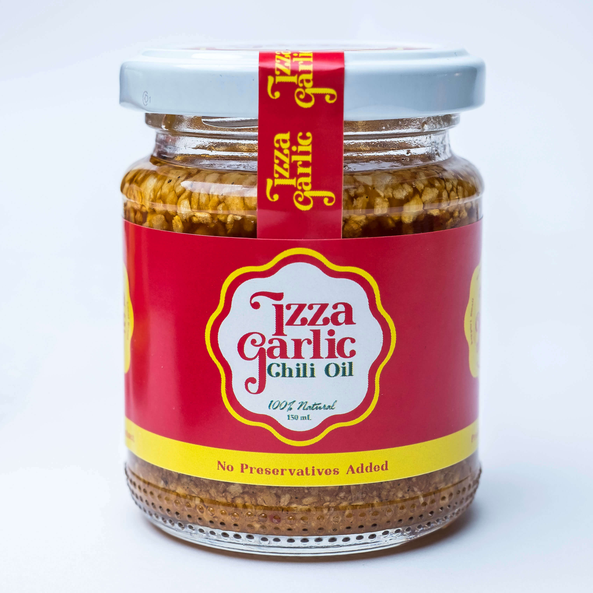
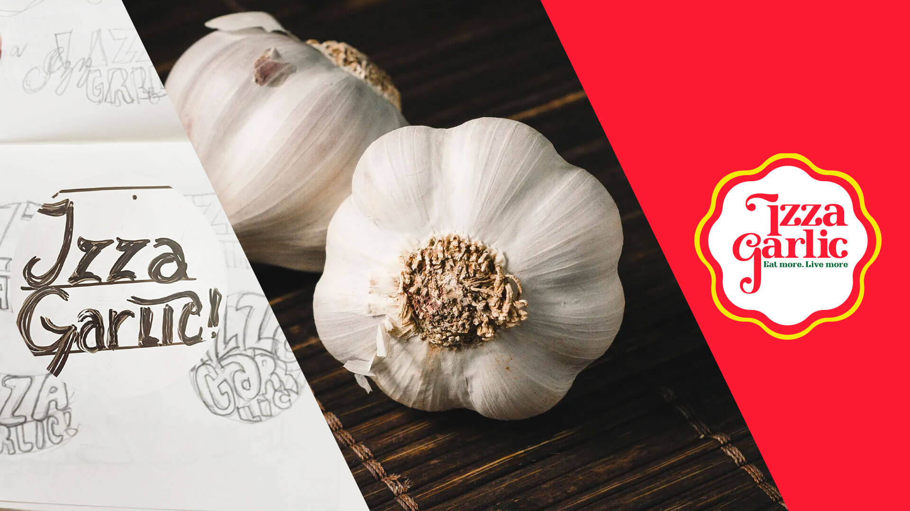

### The Challenge

\
Izza Garlic needed to develop their brand message and simplify their brand identity in terms of design, brand positioning, social media engagement, and attracting leads.

The Solution

\
To address Izza Garlic’s branding issues, Tribox Design gathered customer data, studying their customer demographic and psychographic profiles.

\
Targeting - Based on our findings, we were able to shift the focus to attract more qualified leads.

\
Identity - We positioned the brand image of Izza Garlic by first defining their vision-mission and goals and establishing the onlyness of their products.

\
Design - The design we developed for the brand was based on meticulous research on the psychology of condiments and packaging. Each design choice was selected with care.

