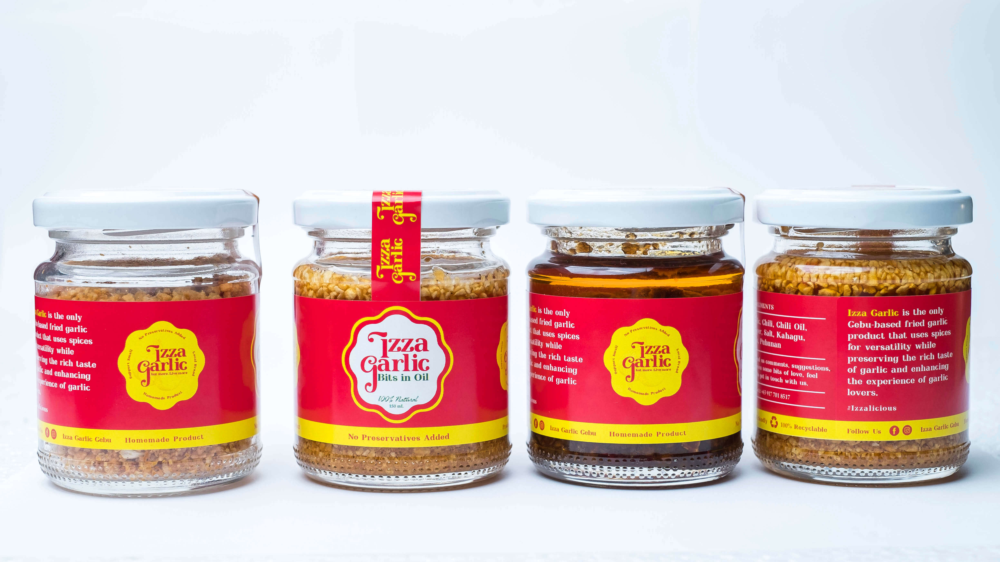

## The Challenge

Izza Garlic needed to develop their brand message and simplify their brand identity in terms of design, brand positioning, social media engagement, and attracting leads.

## The Solution

To address Izza Garlic’s branding issues, Tribox Design gathered customer data, studying their customer demographic and psychographic profiles.

## Targeting

Based on our findings, we were able to shift the focus to attract more qualified leads.

## Identity

We positioned the brand image of Izza Garlic by first defining their vision-mission and goals and establishing the onlyness of their products.

## Design

The design we developed for the brand was based on meticulous research on the psychology of condiments and packaging. Each design choice was selected with care.

