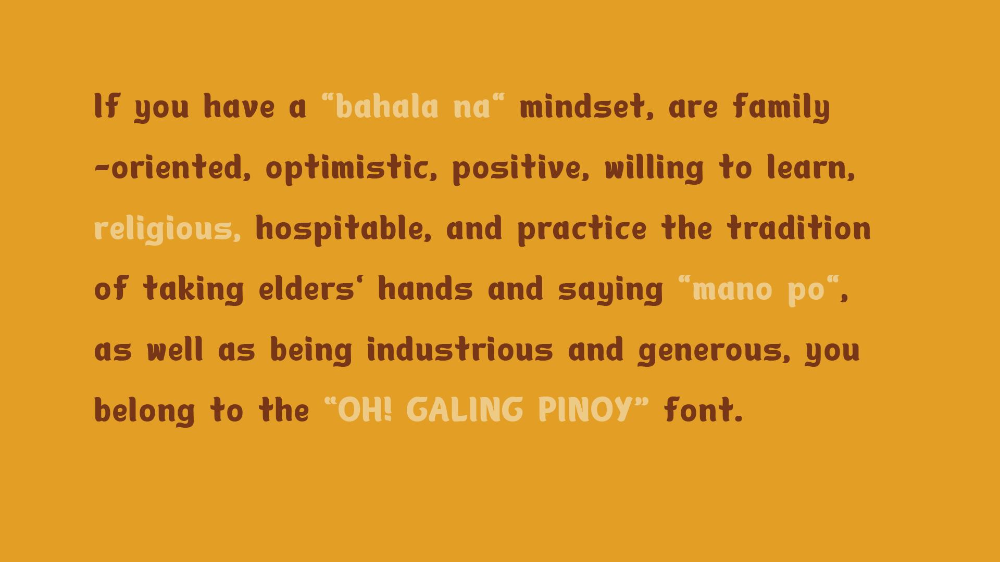
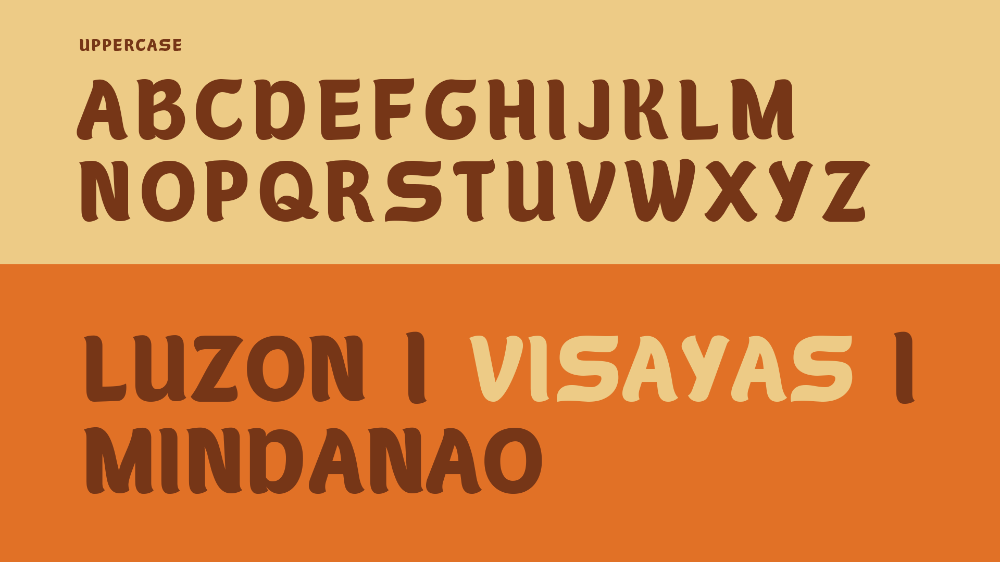
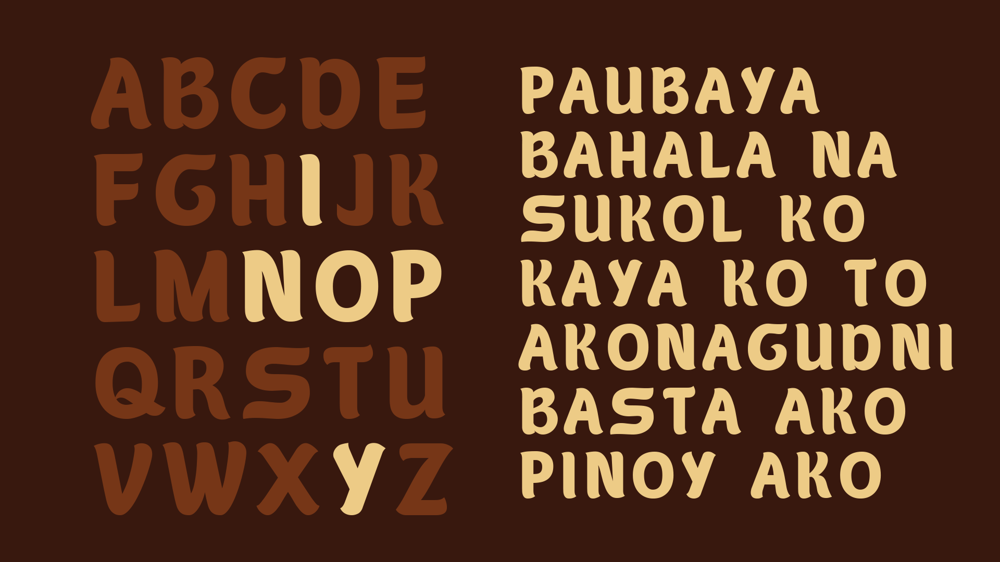
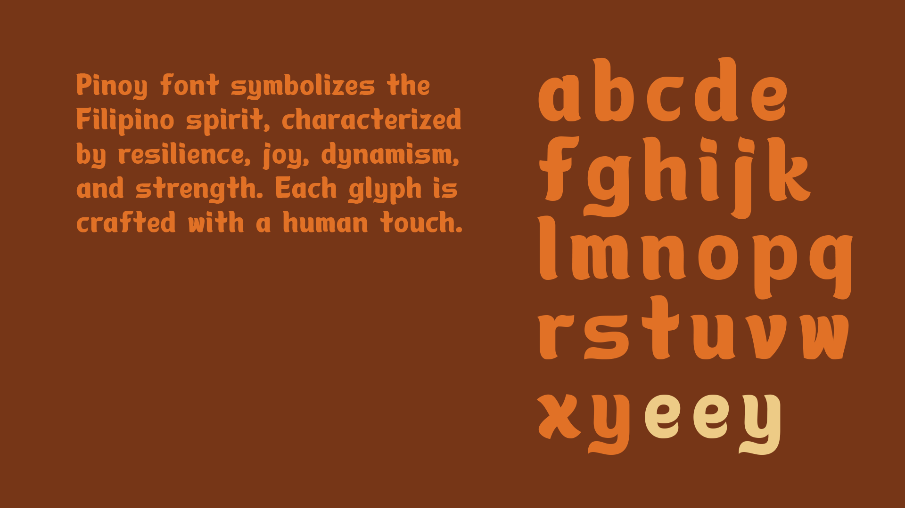
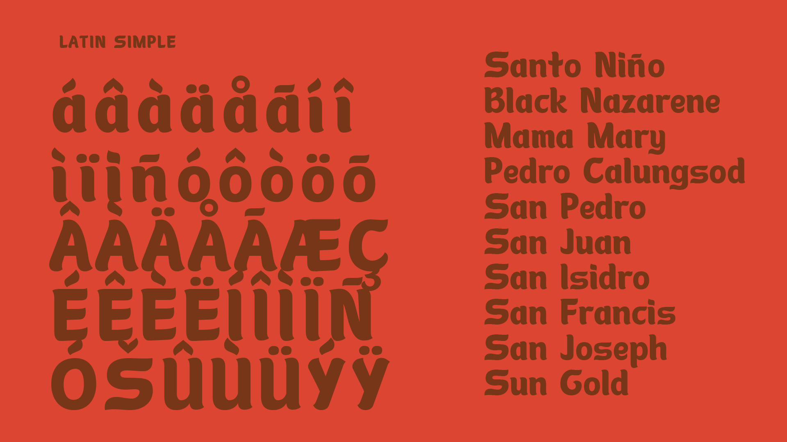

<!--StartFragment-->

If you have a "bahala na" mindset, are family-oriented, optimistic, positive, willing to learn, religious, hospitable, and practice the tradition of taking elders' hands and saying "mano po", as well as being industrious and generous, you belong to the “OH! GALING PINOY” font.

<!--EndFragment-->

