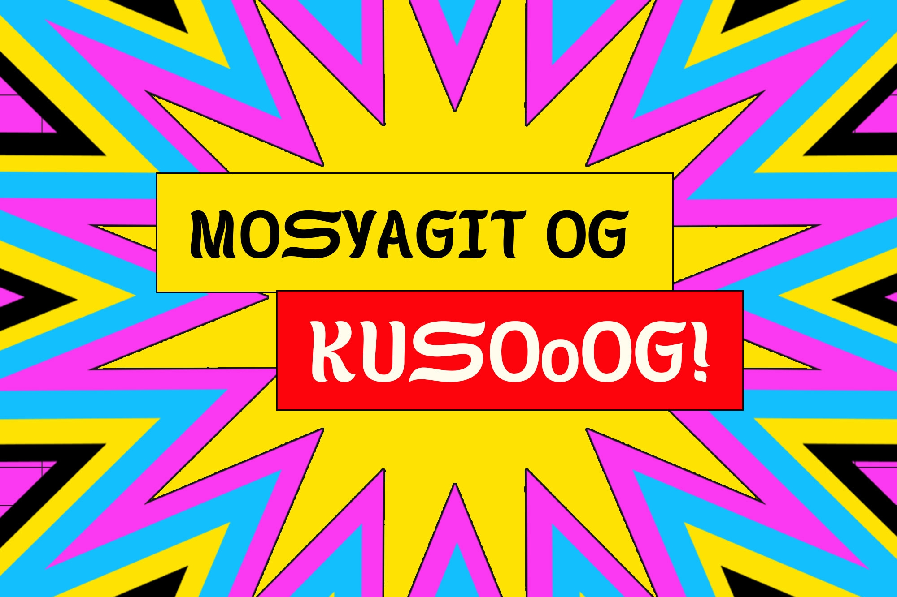
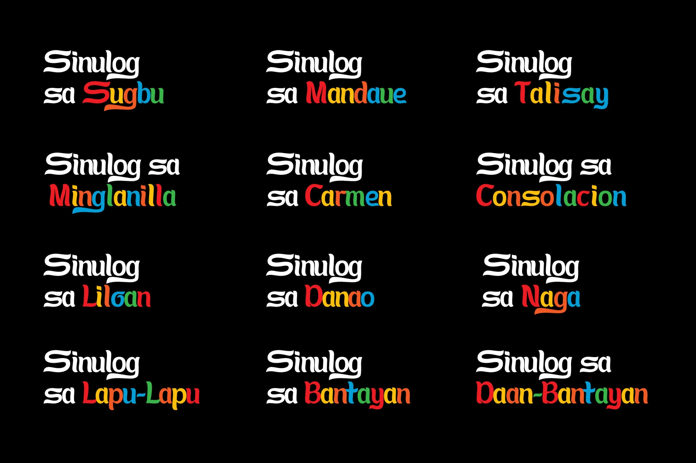
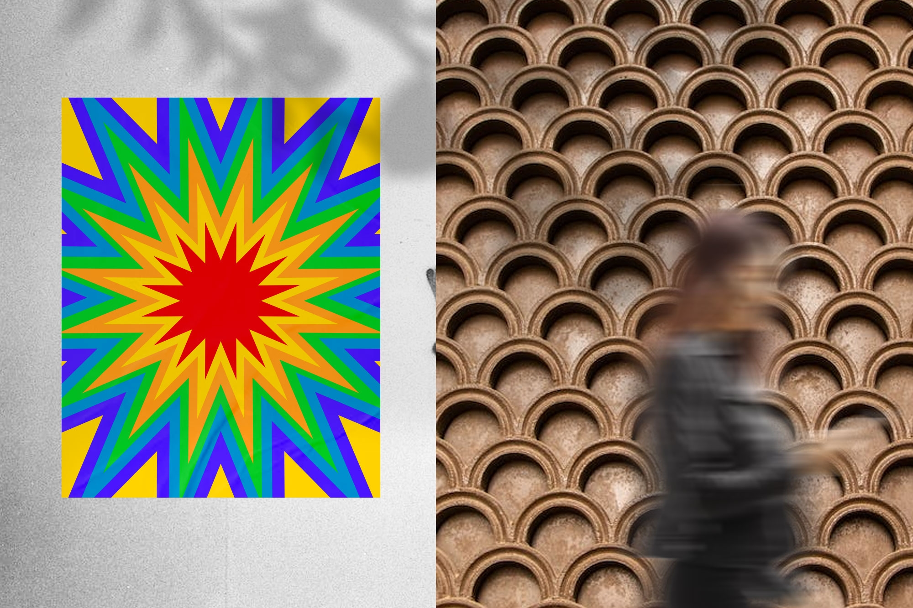

In celebration of Fiesta de Señor Santo Niño, our team created a font called “Sulog” as a gift for our beloved Señor Santo Niño. “Sinulog” is derived from the Cebuano term “sulog”, meaning “current” or “flow of water”, which can be used to describe forward-backward movement of the Sinulog dance. We retained the original structure of the wordmark, the curves that represent resilience, or “kalig-on”. The font has glyphs in upper case, lower case, numbers, and symbols. We also added glyphs for the letters ‘g’ and ‘y’ with tails, upper and lowercase ‘ñ’, and the letter ‘o’. Everything you’ve seen in the images is a mockup, and it only works for virtual viewing.

The Tribox Design team teamed up with local artists, photographers, and individuals to help make this project possible. We would like to thank Insights Cebu, Dreamyria, Stevensonnet Art, JEGI Design, and Amabelle Lorraine Piñon.

If you are a creative, artist, or designer and would like to use our font, you can download it for free. We’re open to any collaboration ideas. Email us at [hello@triboxdesign.com](mailto:hello@triboxdesign.com) for inquiries.

