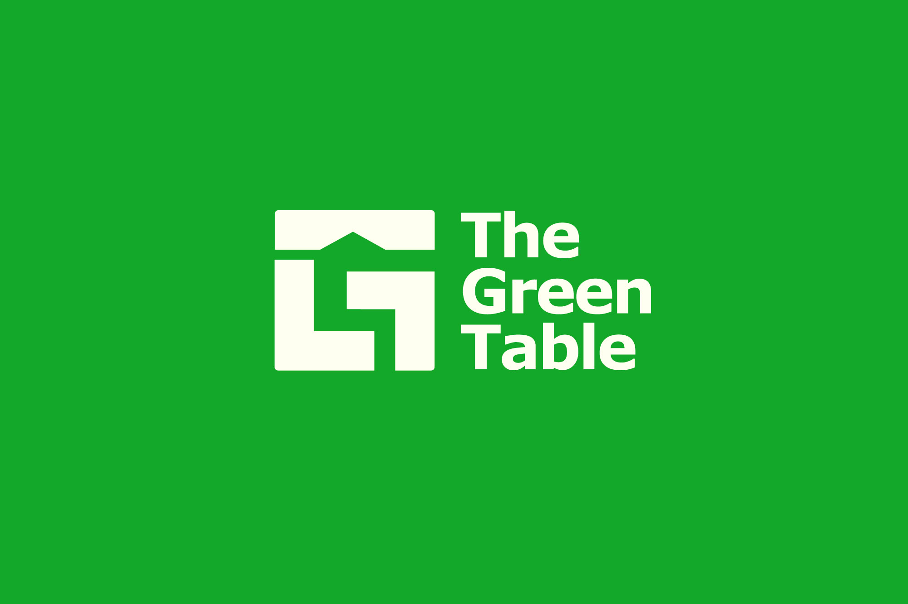
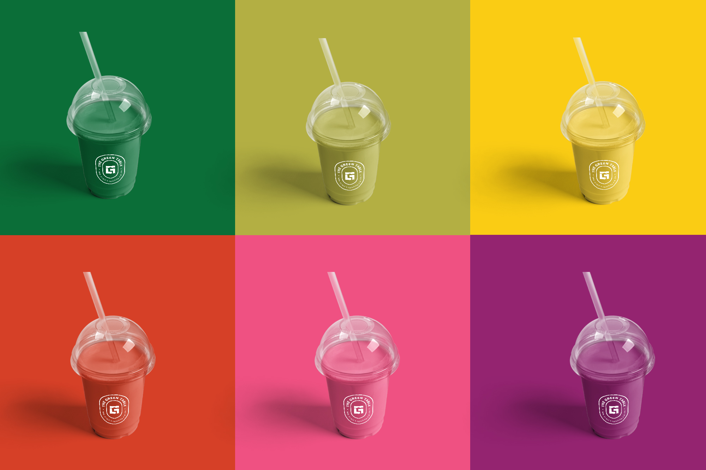

<!--StartFragment-->

The company is an e-commerce business that offers delivery service of fresh, natural, and locally grown fruits and vegetables, meat and poultry, and other farm produce and products to consumers. Mr. Kho was one of the entrepreneurs whose other lines of businesses have been disrupted by the COVID-19 pandemic, prompting the need to find a more sustainable livelihood. The founder had decided to rebrand The Green Table to better project their vision – to ensure that every household has easy access to healthy food, and to support local farmers, the food security frontliners, who play a crucial part in our fight against this pandemic.

The team helped position The Green Table’s products and services then designed a professional and service-oriented brand identity to help stand out in the market. Part of the rebranding process is to go through a Discovery Workshop which includes defining their mission-vision and goals, understanding consumers’ demographic and psychographic profiles, identifying their market competitors, identifying their value propositions, establishing the only-ness and uniqueness of their products and services, defining their new voice and culture, and identifying their marketing channels.

For the new brand identity, the team reworked a few elements while retaining the chair and table outline of the old logo to stay true to The Green Table’s mission-vision and core values. The designers also added the negative space that forms the farmers' hat, farmers’ hut, and farm landscape, increasing brand recognition and continuing the equity of the brand image.

The new brand identity symbolizes a connected community, particularly between farmers and consumers. Mr. Kho states, “There wouldn’t be a ‘green table’ without the farmers. The farm-to-table business has also provided livelihood opportunities to habal-habal or Angkas riders for its delivery service and the women's community in Tabogon that produces eco-bags for The Green Table’s customers." The team also came up with a secondary mark that is meant to be utilized for offline marketing collaterals. Tribox Design completed the project with a full Brand Identity System to effectively communicate

The Green Table’s brand value to its target market. This includes a primary brand mark or logo design, secondary brand mark, color palette, typography, custom icons, and brand tone.

The Green Table: Made Easier & Healthier for You

They envisioned to be the first choice for healthy smoothies and locally produced fruits and vegetables while empowering local farmers to go beyond their capabilities.

<!--EndFragment-->

